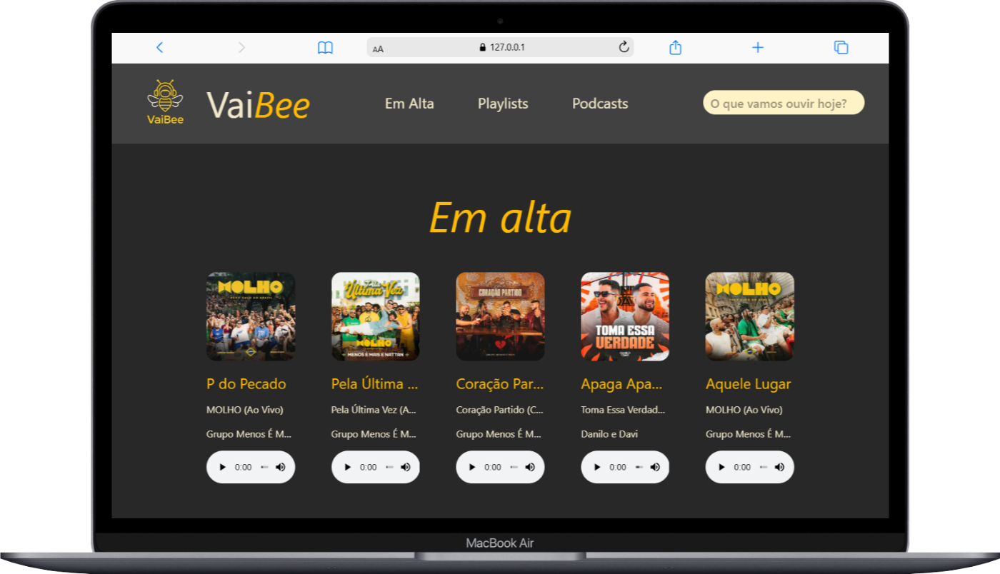
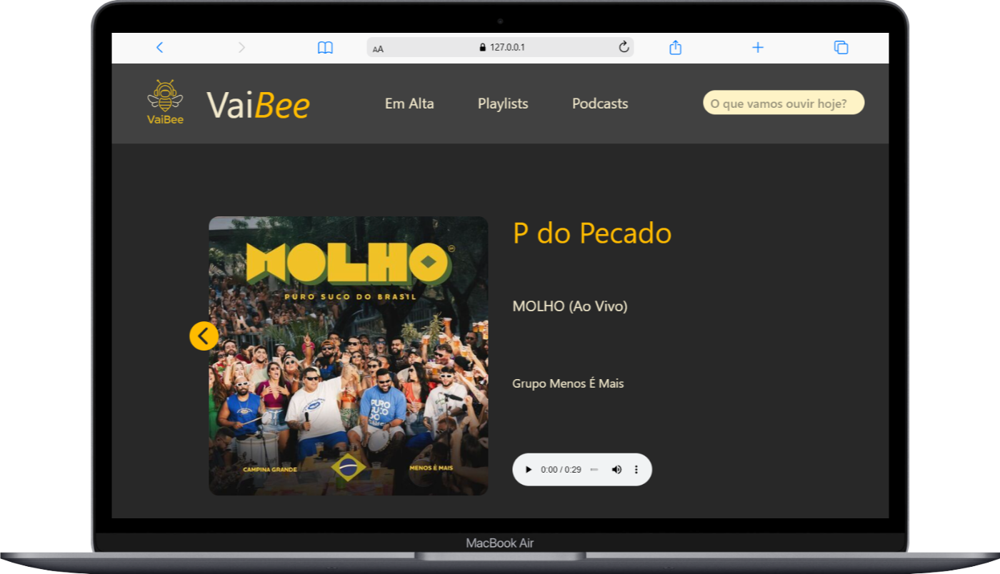
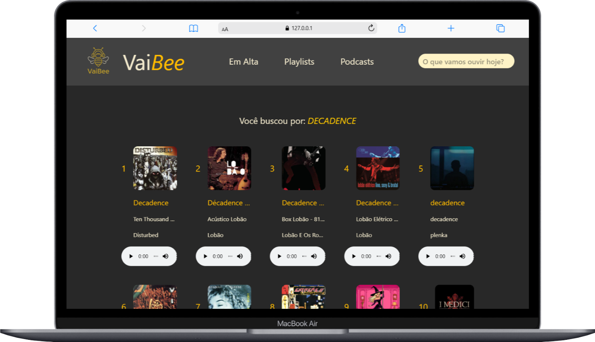

# Vibee (Streaming de música, playlists e podcasts com a API do Deezer)

## 🔧 Tecnologias usadas:

#### - HTML

#### - TailwindCSS

#### - JavaScript

#### 📱 Responsivo: funciona tanto no mobile quanto no desktop.

#

## ⚠️ Aviso Legal

#### Este projeto tem caráter exclusivamente educacional.

#### O nome, marca e identidade visual da Deezer são de propriedade de seus respectivos detentores de direitos.

#### Todos os direitos são reservados.

## Tela inicial mobile

#

## Tela inicial tablet

#

## Tela inicial desktop

#

## Detalhes da musica

#

## Resultados da busca

